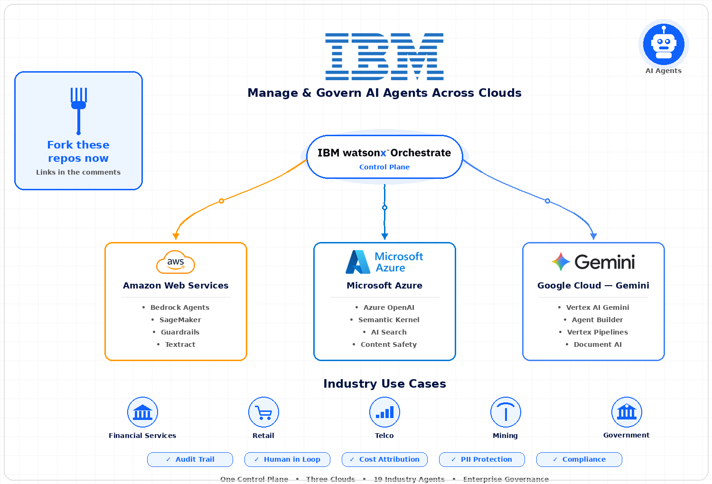
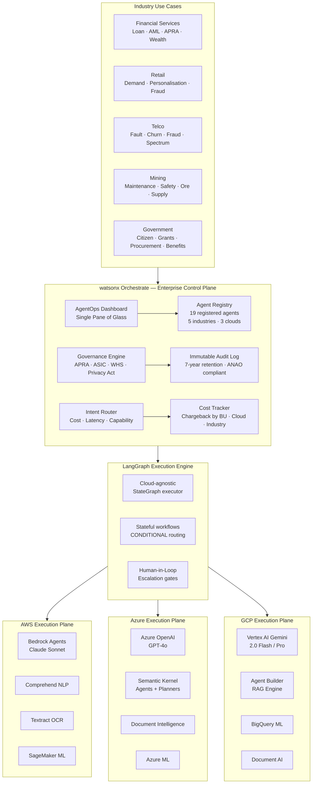
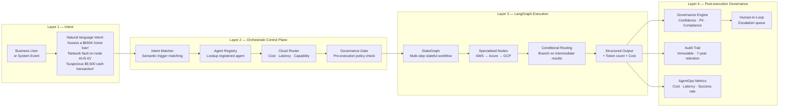
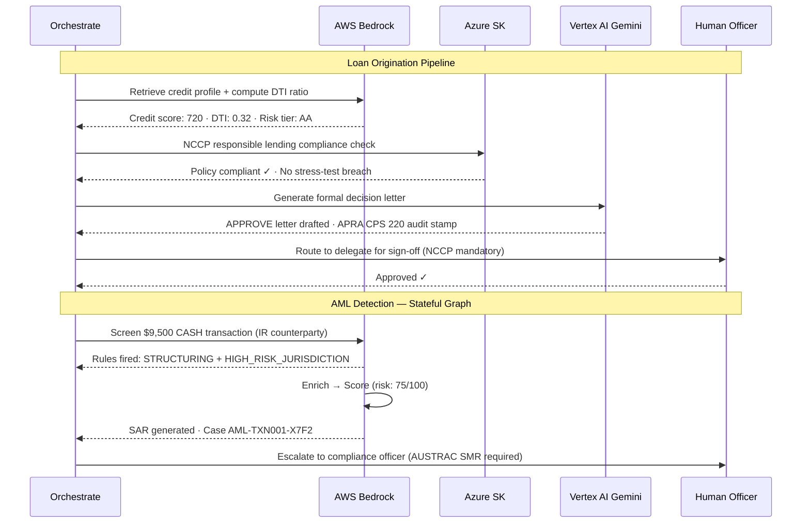
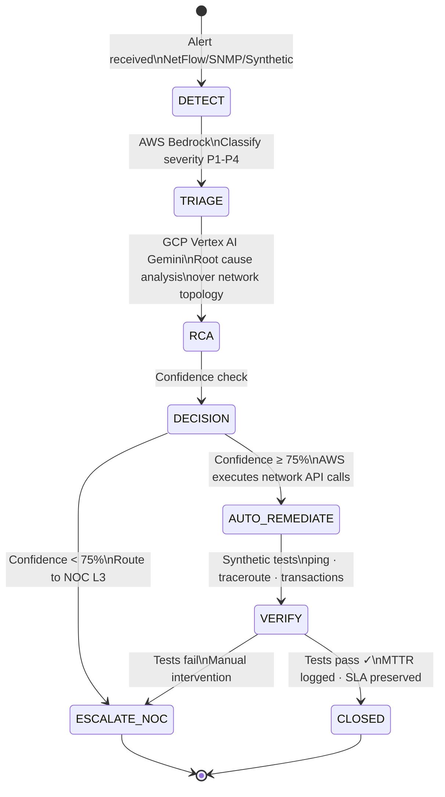
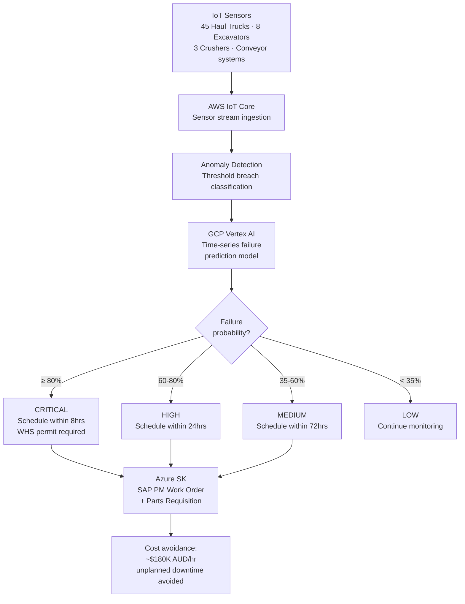
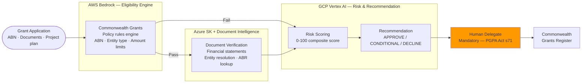
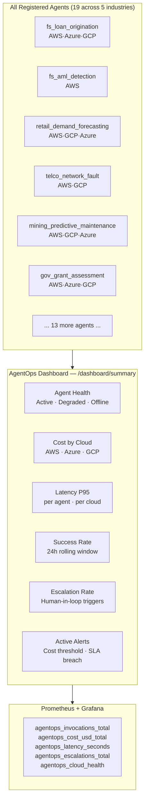

# Cross-Cloud AgentOps — Enterprise AI Agent Control Plane




**Author:** Ramy Amer  
**Region:** ap-southeast-2 / australiaeast / australia-southeast1

---

Every enterprise running AI at scale faces the same hidden problem: **agents are proliferating faster than governance can keep up.** An AWS Bedrock Agent doing loan origination. An Azure Semantic Kernel agent handling customer complaints. A Vertex AI Agent Builder answering policy questions. A LangGraph agent detecting fraud. Nobody can answer:

> *What are all my agents doing right now? Which ones are failing? Which decisions did they make? Who authorised them? What did they cost? Are we compliant?*

This repository is the answer. **watsonx Orchestrate acts as the enterprise control plane** — a single pane of glass governing every AI agent across AWS, Azure, and GCP. LangGraph provides the stateful execution engine. Each cloud is an interchangeable execution plane.

---

## The Architecture Story



---

## How It Works — The Three Layers



---

## Industry Use Cases

### Financial Services — 4 Agents



### Telco — Network Fault Remediation



### Mining — Predictive Maintenance



### Government — Grant Assessment



---

## AgentOps — Single Pane of Glass



---

## Project Structure

```
cross-ai-cloud-AgentOps/
├── config/
│   └── orchestrate_config.yaml          # ← All 19 agents registered here
│
├── src/
│   ├── control_plane/
│   │   ├── orchestrate_client.py        # watsonx Orchestrate integration, routing, workflows
│   │   ├── agent_registry.py            # Agent discovery, health, skill cards
│   │   ├── governance.py                # Policy enforcement, PII, HITL, audit
│   │   └── skill_catalog.py             # Skill definitions for Orchestrate
│   │
│   ├── executor/
│   │   └── langgraph_executor.py        # Cloud-agnostic LangGraph runner
│   │
│   ├── industries/
│   │   ├── financial_services/
│   │   │   ├── loan_origination.py      # ★ Full: AWS credit → Azure policy → GCP letter
│   │   │   ├── aml_detection.py         # ★ Full: Stateful AML graph + SAR generation
│   │   │   ├── regulatory_reporting.py  # APRA/ASIC multi-agent pipeline
│   │   │   └── wealth_advisory.py       # Portfolio analysis agent chain
│   │   │
│   │   ├── retail/
│   │   │   ├── demand_forecasting.py    # ★ Full: AWS ingest → GCP ML → Azure orders
│   │   │   ├── customer_personalisation.py
│   │   │   ├── returns_fraud.py
│   │   │   └── supplier_negotiation.py
│   │   │
│   │   ├── telco/
│   │   │   ├── network_fault_remediation.py  # ★ Full: Triage → RCA → Auto-remediate
│   │   │   ├── churn_intervention.py
│   │   │   └── fraud_detection.py
│   │   │
│   │   ├── mining/
│   │   │   ├── predictive_maintenance.py     # ★ Full: Sensors → Prediction → Work order
│   │   │   ├── safety_compliance.py
│   │   │   ├── ore_grade_optimisation.py
│   │   │   └── supply_chain_disruption.py
│   │   │
│   │   └── government/
│   │       ├── grant_assessment.py           # ★ Full: Eligibility → Docs → Risk → Delegate
│   │       ├── citizen_services.py
│   │       ├── procurement_compliance.py
│   │       └── fraud_benefits.py
│   │
│   └── agentops/
│       ├── dashboard.py                 # FastAPI + Prometheus single pane of glass
│       ├── cost_tracker.py              # Per-agent/cloud/BU cost attribution
│       ├── health_monitor.py            # Agent health polling
│       └── audit_logger.py              # Immutable audit trail
│
├── tests/unit/
│   └── test_agentops.py                 # Registry, governance, cost, graph tests
│
├── notebooks/
│   ├── 01_orchestrate_control_plane.ipynb
│   ├── 02_financial_services_agents.ipynb
│   ├── 03_retail_agents.ipynb
│   ├── 04_telco_agents.ipynb
│   ├── 05_mining_agents.ipynb
│   └── 06_government_agents.ipynb
│
├── pyproject.toml
└── README.md
```

---

## Quick Start

```bash
git clone https://github.com/romeosd/cross-ai-cloud-AgentOps.git
cd cross-ai-cloud-AgentOps

python3.12 -m venv .venv && source .venv/bin/activate
pip install -e ".[dev]"
```

### Configure credentials

```bash
# watsonx Orchestrate
export ORCHESTRATE_API_URL=https://api.us-south.watsonx.ai/v1
export ORCHESTRATE_INSTANCE_ID=your-instance-id
export ORCHESTRATE_API_KEY=your-api-key

# AWS
export AWS_DEFAULT_REGION=ap-southeast-2
export AWS_BEDROCK_AGENT_ID=your-agent-id

# Azure
export AZURE_OPENAI_ENDPOINT=https://your-name.openai.azure.com/
export AZURE_OPENAI_API_KEY=your-key

# GCP
export GCP_PROJECT_ID=your-project-id
export GOOGLE_APPLICATION_CREDENTIALS=/path/to/sa-key.json
```

### Run a financial services workflow

```python
from src.control_plane.orchestrate_client import OrchestrateClient
import asyncio

client = OrchestrateClient()

result = asyncio.run(client.invoke_workflow(
    agent_id="fs_loan_origination",
    payload={
        "applicant_name": "Jane Doe",
        "loan_amount": 650000,
        "loan_term_years": 30,
        "annual_income": 145000,
        "existing_debts": 12000,
    }
))

print(f"Decision: {result.final_output['decision']}")
print(f"Clouds used: {result.clouds_used}")
print(f"Total cost: ${result.total_cost_usd:.4f}")
print(f"Human approval required: {result.human_approvals_required > 0}")
```

### Run via intent routing

```python
result = asyncio.run(client.route_by_intent(
    "I need to assess a $650,000 home loan application for Jane Doe",
    context={"branch": "Melbourne CBD", "channel": "broker"},
))
```

### Start the AgentOps Dashboard

```bash
uvicorn src.agentops.dashboard:app --host 0.0.0.0 --port 8080

# Endpoints:
# GET /dashboard/summary          — full metrics snapshot
# GET /dashboard/agents/{id}      — single agent detail
# GET /dashboard/registry         — skill catalog
# GET /metrics/prometheus         — Prometheus scrape endpoint
```

### Run tests

```bash
pytest tests/unit/ -v
```

---

## Registered Agents — Full Catalog

| Industry | Agent ID | Clouds | Orchestration | SLA | Human Approval |
|----------|----------|--------|---------------|-----|----------------|
| **Financial Services** | `fs_loan_origination` | AWS·Azure·GCP | Sequential | 120s | ✓ NCCP |
| | `fs_aml_detection` | AWS | Stateful graph | 30s | ✓ AUSTRAC |
| | `fs_regulatory_reporting` | AWS·Azure·GCP | Parallel→Merge | 600s | ✓ APRA |
| | `fs_wealth_advisory` | GCP·Azure | Sequential | 60s | — |
| **Retail** | `retail_demand_forecasting` | AWS·GCP·Azure | Sequential | 180s | — |
| | `retail_personalisation` | GCP·AWS | Stateful graph | 5s | — |
| | `retail_returns_fraud` | AWS·Azure | Sequential | 10s | ✓ |
| | `retail_supplier_negotiation` | GCP·Azure | Stateful graph | 300s | — |
| **Telco** | `telco_network_fault` | AWS·GCP | Stateful graph | 60s | — |
| | `telco_churn_intervention` | GCP·Azure·AWS | Sequential | 15s | — |
| | `telco_fraud_detection` | AWS·Azure | Parallel | 5s | ✓ |
| **Mining** | `mining_predictive_maintenance` | AWS·GCP·Azure | Stateful graph | 30s | WHS CRITICAL |
| | `mining_safety_compliance` | GCP·AWS | Sequential | 10s | ✓ WHS |
| | `mining_ore_optimisation` | GCP·AWS | Sequential | 120s | — |
| | `mining_supply_chain` | Azure·GCP | Stateful graph | 180s | — |
| **Government** | `gov_citizen_services` | Azure·AWS | Sequential | 10s | — |
| | `gov_grant_assessment` | AWS·Azure·GCP | Sequential | 300s | ✓ PGPA |
| | `gov_procurement_compliance` | Azure·GCP | Sequential | 240s | ✓ CPRs |
| | `gov_benefits_fraud` | AWS·Azure | Parallel→Merge | 60s | ✓ Privacy Act |

---

## Governance & Compliance

| Standard | Coverage |
|----------|----------|
| APRA CPS 220 | Risk management — risk scoring, escalation thresholds, decision audit |
| APRA CPS 230 | Operational resilience — circuit breakers, multi-cloud fallback |
| APRA CPS 234 | Information security — PII controls, 7-year audit retention |
| AUSTRAC AML/CTF Act | AML rules engine, SAR generation, FATF typology detection |
| NCCP Act 2009 | Responsible lending — DTI limits, stress-test buffer (rate + 3%) |
| PGPA Act 2013 | Grant delegate authority — mandatory human sign-off |
| WHS Act 2011 | Mining safety — CRITICAL work order escalation, permit requirements |
| Privacy Act 1988 | PII detection and redaction in all agent outputs |
| ISO/IEC 42001 | AI governance documentation and audit trail |

---

## Cost Optimisation by Cloud

| Cloud | Model | Input/1K tokens | Output/1K tokens | Best for |
|-------|-------|----------------|-----------------|---------|
| AWS | Claude 3.5 Sonnet | $0.003 | $0.015 | Complex reasoning, long documents |
| Azure | GPT-4o | $0.0025 | $0.010 | Structured output, function calling |
| GCP | Gemini 2.0 Flash | $0.000075 | $0.000300 | High-volume classification, extraction |

Orchestrate's cost-optimised routing automatically routes high-volume, simple tasks to GCP (50× cheaper per token than AWS for these workloads) and reserves AWS/Azure for tasks requiring complex reasoning or document analysis.

---

*Built by Ramy Amer — Cross-Cloud AgentOps | watsonx Orchestrate + LangGraph + AWS + Azure + GCP*
